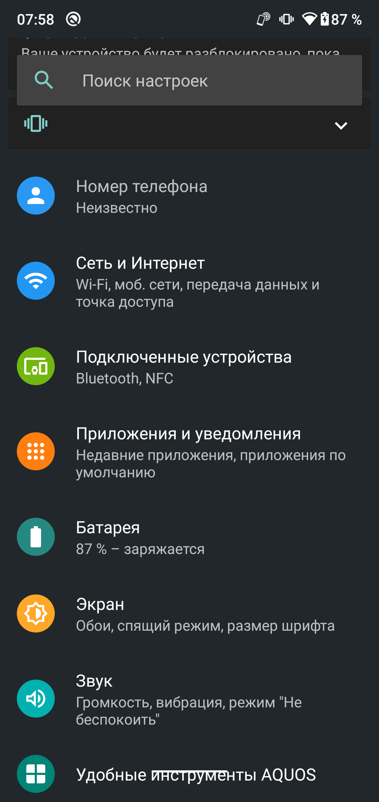

# Домашнее Задание №1

## Условие

1. Научиться подключаться к телефону по ADB

2. Проверить версию ядра и uptime  
   `adb shell cat /proc/version`  
   `adb shell cat /proc/uptime`

3. Посмотреть список примонтированных разделов  
   `adb shell mount`

4. Увидеть нагрузку и процессы  
   `adb shell top`

5. Попробовать работу с файлами  
   `adb shell`  
   `cd /sdcard`  
   `mkdir testfolder`  
   `echo "Hello from ADB" > testfolder/testfile.txt`  
   `ls -l testfolder`  
   `cat testfolder/testfile.txt`

6. Сведения об установленных приложениях  
   `adb shell`  
   `pm list packages`  
   `pm list packages -3 # Найти отличия`  
   `dumpsys package com.android.chrome`

7. Снять лог  
   `adb logcat -v time # Остановка нажатием Ctrl + C`

8. Применить фильтр по тэгу и уровню  
   `adb logcat ActivityManager:I *:S`

9.  Просмотреть логи разных буферов  
   `logcat -b main`  
   `logcat -b system`  
   `logcat -b crash`  
   `logcat -b events`

10. Просмотреть системные свойства  
   `getprop ro.build.version.release`  
   `getprop ro.product.model`  
   `getprop ro.product.model`

11. Управление приложениями  
   `adb install путь_к_apk`  
   `adb uninstall <имя_пакета>`

12. Остановка и запуск приложений  
   `adb shell am force-stop <имя_пакета>`  
   `*adb shell am start -n <имя_пакета>/<имя_Activity>`  
   `-> adb shell am start -n com.android.settings/.Settings`

13. Снимки экрана и запись экрана  
   `adb shell screencap -p /sdcard/screen.png`  
   `adb pull /sdcard/screen.png`  
   `adb shell screenrecord /sdcard/demo.mp4`

14. Выполнить Monkey-тест  
   `monkey -p com.android.settings -v 10 # (!!! Аккуратно)`

## Отчёт

1. ```console
   transaero21@TP-PF48AJM9:~$ adb devices
   List of devices attached
   357784090208883 device
   ```

2. ```console
   transaero21@TP-PF48AJM9:~$ adb shell cat /proc/version
   Linux version 4.9.186-perf (sharp@TG7Y0701) (gcc version 4.9.x 20150123 (prerelease) (GCC) ) #1 SMP PREEMPT Wed Jan 13 02:43:59 JST 2021

   transaero21@TP-PF48AJM9:~$ adb shell cat /proc/uptime
   91562.29 157139.36
   ```

3. ```console
   transaero21@TP-PF48AJM9:~$ adb shell mount
   /dev/block/dm-1 on / type ext4 (ro,seclabel,relatime,discard)
   tmpfs on /dev type tmpfs (rw,seclabel,nosuid,relatime,size=1866180k,nr_inodes=466545,mode=755)
   devpts on /dev/pts type devpts (rw,seclabel,relatime,mode=600,ptmxmode=000)
   proc on /proc type proc (rw,relatime,gid=3009,hidepid=2)
   ...
   ```

4. ```console
   transaero21@TP-PF48AJM9:~$ adb shell top
   Tasks: 826 total,   1 running, 825 sleeping,   0 stopped,   0 zombie
     Mem:      3.5G total,      3.4G used,      119M free,       15M buffers
    Swap:      1.5G total,      1.1G used,      396M free,      1.3G cached
   800%cpu   2%user   0%nice   5%sys 791%idle   0%iow   1%irq   1%sirq   0%host
     PID USER         PR  NI VIRT  RES  SHR S[%CPU] %MEM     TIME+ ARGS
    5147 shell        20   0  38M 4.5M 2.8M R  3.0   0.1   0:01.81 top
   30815 root         20   0    0    0    0 S  1.0   0.0   0:09.60 [kworker/u16:16]
   ...
   ```

5. ```console
   transaero21@TP-PF48AJM9:~$ adb shell
   SG803SH:/ $ cd /sdcard
   SG803SH:/sdcard $ mkdir testfolder
   SG803SH:/sdcard $ echo "Hello from ADB" > testfolder/testfile.txt
   SG803SH:/sdcard $ ls -l testfolder
   total 8
   -rw-rw---- 1 root sdcard_rw 15 2025-04-12 07:52 testfile.txt
   SG803SH:/sdcard $ cat testfolder/testfile.txt
   Hello from ADB
   ```

6. Флаг -3 означает third-party (несистемные пакеты - пользовательские) 

7. `-v time` - добавляет метку времени к каждому сообщению, формат - `MM-DD HH:MM:SS.mmm`

8. Фильтр по тэгу и уровню
   - `ActivityManager:I` - показывает только логи с тегом ActivityManager уровня INFO (I) и выше
   - `*:S`
     - `*` - означает "все остальные теги"
     - `:S` - SILENT, то есть скрывает все логи, кроме указанных в первом правиле (ActivityManager:I)

9. Логи разных буферов
   - `main` – основные логи приложений и системы (по умолчанию)
   - `system` – логи системных сервисов и компонентов Android
   - `crash` – сообщения о крашах приложений
   - `events` – системные события (запуск приложений, broadcast'ы, низкоуровневые события ядра)

</br>

10. ```console
    SG803SH:/ $ getprop ro.build.version.release
    10
    SG803SH:/ $ getprop ro.product.model
    803SH
    SG803SH:/ $ getprop ro.product.manufacturer
    SHARP
    SG803SH:/ $
    ```

11. ```console
    transaero21@TP-PF48AJM9:~$ adb install JoinDeveloperPreviewProgram.apk
    Performing Streamed Install
    Success

    transaero21@TP-PF48AJM9:~$ adb uninstall jp.co.sharp.android.beta.reception
    Success
    ```

12. ```console
    transaero21@TP-PF48AJM9:~$ adb shell am start -n com.android.settings/.Settings
    Starting: Intent { cmp=com.android.settings/.Settings }
    ```

13. Снимки экрана и запись экрана  
    <div style="display: flex; gap: 20px; align-items: center; margin: 16px 0;">
      
      <video width="400" controls>
        <source src="demo.mp4" type="video/mp4">
      </video>
    </div>

14. `monkey` - инструмент для тестирования Android-приложений через UI стресстесты
    - `-p com.android.settings` - тестировать только приложение Настройки
    - `-v` - подробный вывод
    - `10` - количество генерируемых событий
